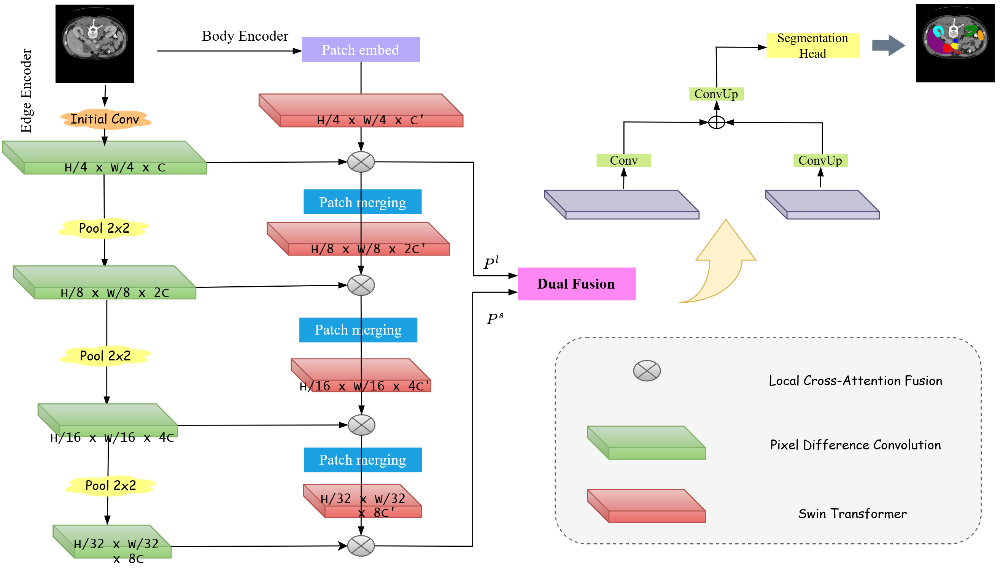

# BEFUnet: A Hybrid CNN-Transformer Architecture for Precise Medical Image Segmentation

:closed_book: [[arxiv]](https://arxiv.org/abs/2402.08793)

# :tada: :tada: :tada: News

- **`2024/02/09` Our paper is accepted by "International Journal of Intelligent Systems" (IF: 7).**

- **`2024/02/21` First release.**


## Train & Test --- Synapse Dataset
Please go to ["Colab_BEFUnet.ipynb"](https://github.com/Omid-Nejati/BEFUnet/blob/main/Colab_BEFUnet.ipynb) for complete detail on dataset preparation and Train/Test procedure or follow the instructions below. [](https://colab.research.google.com/drive/111rqGXSHQ6v6grXuA3VyhWBxZkNtGZrz?usp=sharing)

## 



# Usage
## Installation
1) Run the following code to install the Requirements.

    `pip install -r requirements.txt`

2) Run the below code to train BEFUnet on the synapse dataset.

    ```bash
    python train.py --root_path ./data/Synapse/train_npz --test_path ./data/Synapse/test_vol_h5  --model_name BEFUnet --batch_size 10 --eval_interval 20 --max_epochs 500 
   ```

3) Run the below code to test BEFUnet on the synapse dataset.
    ```bash
    python test.py --test_path ./data/Synapse/test_vol_h5 --model_name BEFUnet --is_savenii --model_weight 
    ```
## Query 
All implementations are done by Omid Nejati Manzari. For any query please contact us for more information.

[*omid.nejaty@gmail.com*](mailto:omid.nejaty@gmail.com)

## Acknowledgement
We borrowed the code from [Swin Transformer](https://github.com/microsoft/Swin-Transformer) and [PiDinet](https://github.com/hellozhuo/pidinet). Thanks for their wonderful works.


## Citation
If you find this project helpful for your research, please consider citing the following BibTeX entry.
```
@article{manzari2024befunet,
  title={BEFUnet: A Hybrid CNN-Transformer Architecture for Precise Medical Image Segmentation},
  author={Manzari, Omid Nejati and Kaleybar, Javad Mirzapour and Saadat, Hooman and Maleki, Shahin},
  journal={arXiv preprint arXiv:2402.08793},
  year={2024}
}
```

